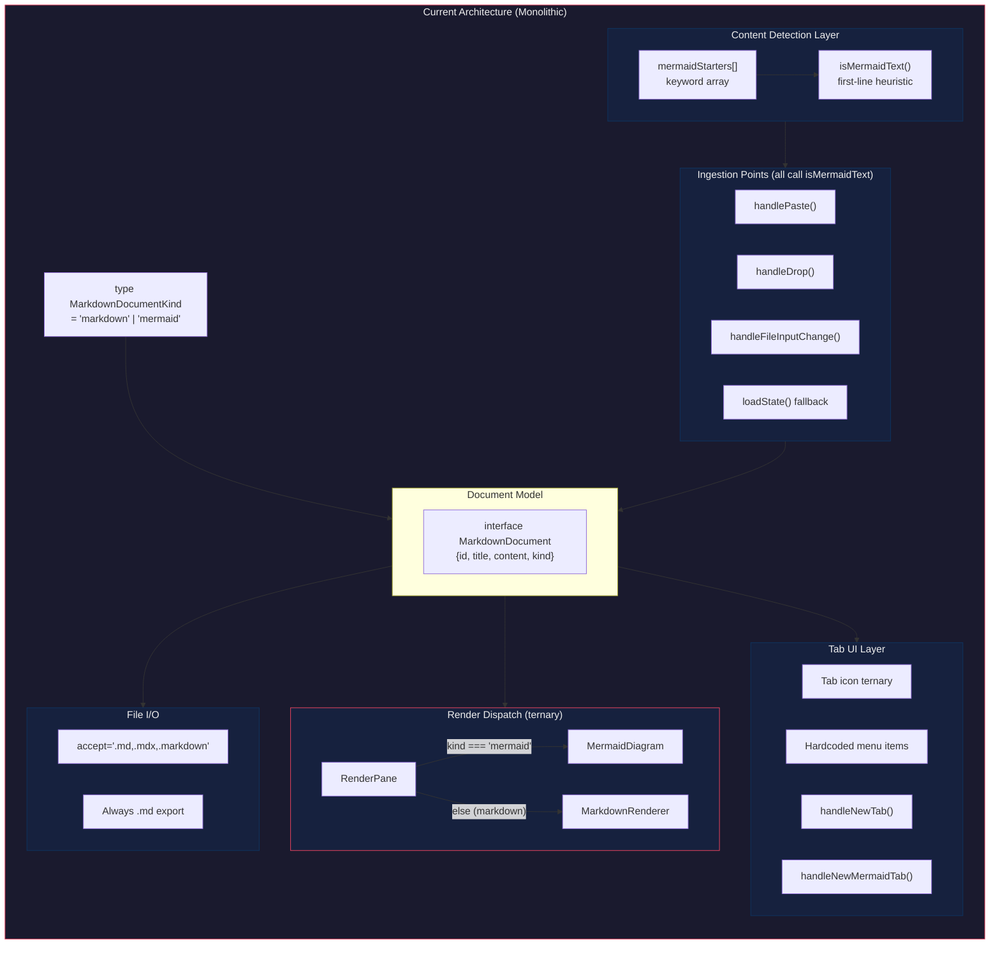
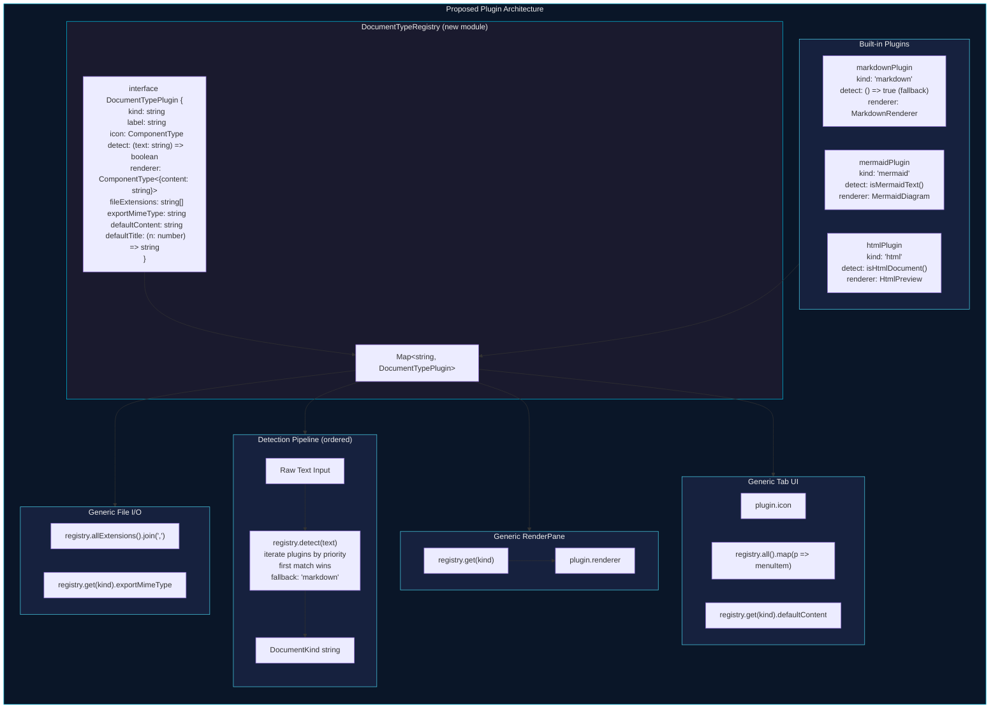
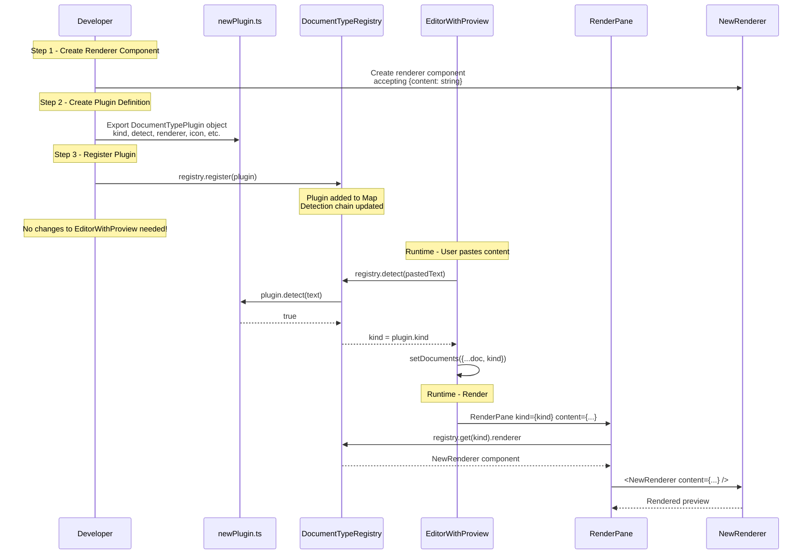

# Document Type System Architecture

## Overview

The mdeditor application supports multiple document types (Markdown, Mermaid, and extensible to others) through a plugin-based document type registry. This document describes the current monolithic architecture, the proposed plugin architecture, and the flow for adding new document types.

## Current Architecture (Monolithic)

All document type awareness is hardcoded into `EditorWithProview.tsx` across 12 distinct coupling points:

| Concern | Location | Mechanism |
|---|---|---|
| **Type definition** | Line 14 | `type MarkdownDocumentKind = 'markdown' \| 'mermaid'` — union literal |
| **Content detection** | Lines 98-125 | `mermaidStarters[]` + `isMermaidText()` — inline heuristic |
| **Render dispatch** | Lines 176-195 | `RenderPane` ternary: `kind === 'mermaid' ? <MermaidDiagram> : <MarkdownRenderer>` |
| **Tab icon dispatch** | Line 255 | Inline ternary on `doc.kind` |
| **New tab factory** | Lines 389-411 | Separate `handleNewTab` / `handleNewMermaidTab` callbacks |
| **New tab menu** | Lines 477-503 | Hardcoded menu items array |
| **Paste detection** | Lines 298-316 | `isMermaidText()` in paste handler |
| **Drop detection** | Lines 336-376 | `isMermaidText()` in drop handler |
| **File import detection** | Lines 441-463 | `isMermaidText()` in file input handler |
| **File accept attr** | Line 518 | Hardcoded `.md,.mdx,.markdown` |
| **Save/export** | Lines 465-475 | Always `text/markdown` with `.md` extension |
| **State restoration** | Lines 206-209 | Fallback: `doc.kind ?? (isMermaidText(...) ? 'mermaid' : 'markdown')` |

### Diagram: Current Monolithic Architecture

## Proposed Plugin Architecture

### Diagram: Plugin-Based Document Type Registry

### Diagram: Adding a New Document Type (Sequence)

## Key Design Decisions

1. **Priority-based detection**: Plugins declare a numeric priority. Higher priority plugins are checked first. Markdown (priority 0) is always the fallback.
2. **Renderer interface normalization**: All renderers accept `{ content: string }`, requiring thin wrapper adapters for existing components that use different prop names.
3. **Registry singleton**: A single shared instance eliminates prop-drilling and context overhead.
4. **Backwards compatibility**: Unknown `kind` values in persisted state gracefully fall back to markdown.
