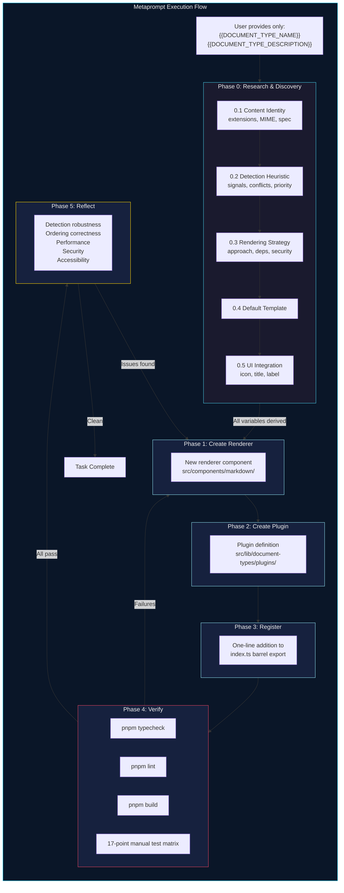

# Metaprompt: Add a New Document Type to mdeditor

## About This Metaprompt

This is a **task-agnostic scaffolding prompt** — a metaprompt — for adding any new document type to the mdeditor application. It does not assume knowledge of what the target document type is. Instead, it provides a structured reasoning framework that guides an agent through **discovery, design, implementation, and verification** for an arbitrary, user-specified document type.

### Design Principles

This metaprompt incorporates patterns from several research traditions:

| Pattern | Source | Application Here |
|---|---|---|
| **Task-agnostic scaffolding** | Suzgun & Kalai, "Meta-Prompting" (2024) | The prompt structure is type-independent; variable slots hold type-specific data |
| **Prompt templates with variable slots** | Anthropic prompt engineering docs | `{{VARIABLE}}` placeholders separate fixed structure from dynamic content |
| **Structured XML-tag data separation** | Anthropic context engineering guide | `<tags>` isolate structured data from instructions |
| **Self-directed planning with verification** | Anthropic "Building Effective Agents" (2024) | Agent plans its own subtasks, runs its own verification loop |
| **Reflection pattern** | Agentic AI design patterns (2025) | Agent reviews its own detection heuristic and renderer for correctness |
| **Incremental artifact trail** | Anthropic "Effective Harnesses for Long-Running Agents" (2025) | Each phase produces a verifiable artifact before the next begins |

### Reference Documents

Before using this metaprompt, ensure you have read:
- `docs/document-type-architecture.md` — Plugin registry architecture, interface definitions, and system diagrams
- `docs/example-html-document-type-prompt.md` — Worked example (HTML) showing the concrete application of this metaprompt

---

## The Metaprompt

Everything below the horizontal rule is the prompt itself. Copy it verbatim and fill in the `{{VARIABLES}}` before handing it to a coding agent.

---

<metaprompt>

### ROLE

You are an expert TypeScript/React software engineer working on the **mdeditor** application at `/Volumes/FLOUNDER/dev/mdeditor`. Your task is to add support for a new document type using the existing plugin-based document type registry.

### SYSTEM CONTEXT

<system_context>
- **Stack**: React 18, Vite 7, TypeScript (strict mode), Tailwind CSS 4.1
- **Package manager**: pnpm (never npm or yarn)
- **Main editor component**: `src/components/markdown/EditorWithProview.tsx`
- **Document type registry**: `src/lib/document-types/registry.ts` (singleton)
- **Plugin interface**: `src/lib/document-types/types.ts` (`DocumentTypePlugin`)
- **Existing plugins**: `markdown` (priority 0, fallback), `html` (priority 5), `json` (priority 8), `mermaid` (priority 10), `graphviz` (priority 11)
- **Plugin directory**: `src/lib/document-types/plugins/`
- **Renderer directory**: `src/components/markdown/`
- **Barrel export**: `src/lib/document-types/index.ts`
</system_context>

### QUALITY GATES

These commands must all pass before the task is considered complete:

```bash
pnpm typecheck   # zero errors (strict mode, noUnusedLocals, noUnusedParameters)
pnpm lint        # zero warnings (--max-warnings 0)
pnpm build       # clean production build
```

Manual testing at `http://localhost:5200` (with `pnpm dev` running) must confirm:
1. New document type appears in the "New Tab" dropdown menu
2. Creating a new tab of this type renders correctly in the preview pane
3. Pasting content of this type into an empty document auto-detects the kind
4. Dropping a file with the appropriate extension opens as this document type
5. Saving/exporting from a tab of this type uses the correct MIME type and file extension
6. Existing markdown and mermaid functionality is completely unaffected

### TASK INPUT

<task_input>
The user wants to add support for the following document type:

**Document type name**: {{DOCUMENT_TYPE_NAME}}
**Description**: {{DOCUMENT_TYPE_DESCRIPTION}}
</task_input>

### PHASE 0: RESEARCH AND DISCOVERY

Before writing any code, you must answer every question in this section. If you cannot answer a question from your existing knowledge, **research it** using web search, documentation, or codebase exploration. Do not guess. Do not proceed to Phase 1 until every question has a confident answer.

<discovery_questions>

#### 0.1 Content Identity

- What is the canonical file extension(s) for this document type?  
  (e.g., `.html`, `.htm` for HTML; `.csv` for CSV; `.json` for JSON)
- What is the standard MIME type for this document type?  
  (e.g., `text/html`, `text/csv`, `application/json`)
- Is there a formal specification or grammar for this document type? Where?

#### 0.2 Detection Heuristic

- What textual signals unambiguously identify this content type when the user pastes raw text?  
  Think about: opening declarations, required structural markers, characteristic first-line patterns, magic bytes/strings.
- Can this content type be confused with markdown? Under what circumstances?  
  (This determines priority: higher priority means the detector runs before markdown's catch-all.)
- Can this content type be confused with mermaid syntax? Under what circumstances?
  **Pattern**: If your format shares keywords with mermaid (e.g., DOT's `graph { }` vs mermaid's `graph TD`), use a **structural heuristic** that mermaid cannot satisfy. For DOT language this is `{` on the header line — mermaid never has a brace on line 1. Combined with priority > 10, this makes detection unambiguous.
- **Propose a priority number**. Standard range is 1-9 (between markdown=0 and mermaid=10). **Priority > 10 is valid** for diagram types that MUST pre-empt mermaid's detection (e.g., DOT language `graph { }` would be stolen by mermaid's `graph` keyword if priority ≤ 10). Justify your choice relative to all existing plugins.
- Write the detection function signature: `(text: string) => boolean`. What specific checks does it perform?

#### 0.3 Rendering Strategy

- How should this content type be rendered for live preview? Options to consider:
  - **Sandboxed iframe** (`srcDoc`) — for content that is itself renderable (HTML, SVG)
  - **Syntax-highlighted code view** — for data formats (JSON, YAML, CSV)
  - **Specialized React component** — for content with rich visual representation (LaTeX, musical notation)
  - **Third-party library** — is there a React-compatible renderer? What is the package name, bundle size, and license?
  - **Hybrid** — combination of approaches (e.g., code view + parsed table for CSV)
- Does the renderer need any **new npm dependencies**? If so, list them with:
  - Package name and version
  - Bundle size (check bundlephobia.com)
  - License compatibility (must be MIT, Apache 2.0, or BSD-compatible)
- Does the renderer need **security sandboxing**? (e.g., user-authored HTML/SVG needs iframe sandbox; JSON does not)
- What should the renderer display when the content is empty?
- What should the renderer display when the content is malformed/invalid?

#### 0.4 Default Template

- What is a sensible default template for a newly created document of this type?  
  It should be minimal but illustrative — a user seeing this template should immediately understand the format.

#### 0.5 UI Integration

- What icon best represents this document type? Check availability in:
  - `lucide-react` (preferred, already in the project)
  - `react-feather` (already in the project)
  - If neither has a suitable icon, propose adding one with justification.
- What should the default title pattern be? (e.g., `Page-1`, `Data-1`, `Sheet-1`)
- What label should appear in the "New Tab" dropdown menu? (e.g., "New HTML", "New JSON File")

</discovery_questions>

Output your answers in a structured format before proceeding:

```
## Discovery Answers

### 0.1 Content Identity
- Extensions: [answer]
- MIME type: [answer]
- Specification: [answer]

### 0.2 Detection Heuristic
- Signals: [answer]
- Confusion with markdown: [answer]
- Confusion with mermaid: [answer]
- Proposed priority: [number] because [justification]
- Detection logic: [pseudocode or description]

### 0.3 Rendering Strategy
- Approach: [answer]
- New dependencies: [none | list]
- Security sandboxing: [yes/no, why]
- Empty state: [description]
- Error state: [description]

### 0.4 Default Template
[the template content]

### 0.5 UI Integration
- Icon: [ComponentName] from [package]
- Default title: [pattern]
- Menu label: [text]
```

### PHASE 1: CREATE THE RENDERER COMPONENT

**Output artifact**: `src/components/markdown/{{RendererComponentName}}.tsx`

<renderer_requirements>

1. **Props interface**: Accept `{ content: string }` — this is the universal renderer contract from `DocumentTypePlugin`
2. **Default export**: Required for React Refresh/HMR compatibility
3. **Empty state handling**: Display a tasteful placeholder when `content` is empty or whitespace-only
4. **Error handling**: If the content is malformed, render gracefully — never throw an unhandled error, never show a blank white panel
5. **Styling consistency**: Match the visual weight and spacing of existing render panes (see `MarkdownRenderer_orig.tsx` and `MermaidDiagram.tsx` for reference)
6. **Performance**: If the rendering is expensive, use appropriate memoization (`memo`, `useMemo`, `useCallback`). Consider debouncing if the render reacts to every keystroke.
7. **TypeScript strict compliance**: No `any` types. Prefer `unknown` where the type is genuinely uncertain.
8. **No side effects on unmount**: Clean up all listeners, observers, intervals, and async operations.

</renderer_requirements>

If new npm dependencies are required:

```bash
pnpm add {{package_name}}
```

Run `pnpm typecheck` after creating the renderer to verify it compiles.

### PHASE 2: CREATE THE PLUGIN DEFINITION

**Output artifact**: `src/lib/document-types/plugins/{{kind}}.ts`

The plugin must satisfy the `DocumentTypePlugin` interface from `src/lib/document-types/types.ts`:

```typescript
import type { DocumentTypePlugin } from '../types'

export const {{kind}}Plugin: DocumentTypePlugin = {
  kind: '{{kind}}',
  label: '{{label}}',
  icon: {{IconComponent}},
  detect: (text: string) => {
    // Detection heuristic from Phase 0, Section 0.2
    // MUST return boolean
    // MUST NOT throw
    // MUST be fast (called on every paste/drop/load)
  },
  priority: {{priority}},
  renderer: {{RendererComponent}},
  fileExtensions: [{{extensions}}],
  exportMimeType: '{{mimeType}}',
  exportExtension: '{{primaryExtension}}',
  defaultContent: {{defaultTemplate}},
  defaultTitle: (n: number) => `{{titlePattern}}${n}`,
}
```

<plugin_checklist>

- [ ] `kind` is a unique lowercase string not already registered
- [ ] `detect` function is pure (no side effects), fast (no async), and deterministic
- [ ] `detect` returns `false` for plain markdown text (prevents false positives stealing from the markdown fallback)
- [ ] `detect` returns `false` for mermaid syntax (no conflict with higher-priority mermaid detector)
- [ ] `priority` is justified relative to existing plugins (markdown=0, html=5, json=8, mermaid=10, graphviz=11); > 10 allowed for diagram types that must pre-empt mermaid
- [ ] `renderer` is the default export of the component created in Phase 1
- [ ] `fileExtensions` all start with `.`
- [ ] `exportMimeType` is a valid IANA media type
- [ ] `defaultContent` is a valid instance of this document type
- [ ] Icon import is from a package already in the project (`lucide-react` or `react-feather`)

</plugin_checklist>

### PHASE 3: REGISTER THE PLUGIN

**Modified artifact**: `src/lib/document-types/index.ts`

Add the import and registration call:

```typescript
import { {{kind}}Plugin } from './plugins/{{kind}}'
documentTypeRegistry.register({{kind}}Plugin)
```

This is the **only existing file that needs modification**. `EditorWithProview.tsx` must NOT be changed — if you feel the need to change it, the registry architecture has a gap that should be fixed at the registry level instead.

### PHASE 4: VERIFICATION

Run all quality gates and manual tests:

<verification_matrix>

| # | Test | Action | Expected Result | Pass? |
|---|------|--------|-----------------|-------|
| 1 | TypeScript | `pnpm typecheck` | Zero errors | |
| 2 | Lint | `pnpm lint` | Zero warnings | |
| 3 | Build | `pnpm build` | Clean production build | |
| 4 | New tab menu | Click "+" dropdown | "New {{label}}" option appears with correct icon | |
| 5 | New tab creation | Select "New {{label}}" | New tab opens with default template, correct icon on tab | |
| 6 | Preview rendering | View the new tab | Default template renders correctly in preview pane | |
| 7 | Content detection (paste) | Paste canonical {{kind}} content into empty doc | Auto-detects as `{{kind}}`, preview switches to correct renderer | |
| 8 | Content detection (negative) | Paste `# Hello World` into empty doc | Stays as `markdown`, NOT misdetected as {{kind}} | |
| 9 | Content detection (negative) | Paste `flowchart TD\n  A --> B` into empty doc | Detects as `mermaid`, NOT misdetected as {{kind}} | |
| 10 | File drop | Drop a `{{primaryExtension}}` file onto editor | Opens as {{kind}} document with correct preview | |
| 11 | File accept dialog | Click import button | File picker includes `{{extensions}}` | |
| 12 | Export/save | Click save on {{kind}} tab | Downloads with `{{primaryExtension}}` extension and `{{mimeType}}` MIME type | |
| 13 | Tab icon | Observe {{kind}} tab | Shows correct icon | |
| 14 | Markdown unaffected | Create and edit a markdown tab | Full markdown rendering works as before | |
| 15 | Mermaid unaffected | Create and edit a mermaid tab | Full mermaid rendering works as before | |
| 16 | State persistence | Reload the page | {{kind}} tab content and kind survive localStorage round-trip | |
| 17 | Backwards compat | Clear localStorage, load app | Default markdown document loads correctly | |

</verification_matrix>

### PHASE 5: REFLECTION

After all tests pass, review your implementation against these criteria:

<reflection_checklist>

1. **Detection robustness**: Could your `detect()` function produce false positives on common markdown content? Test mentally with: `# Hello`, `- list item`, `**bold**`, `| table | row |`, `` ```code``` ``.
2. **Detection ordering**: Is your priority value correct? Would reordering cause a different plugin to match first incorrectly?
3. **Renderer edge cases**: What happens with 10,000+ lines of content? Does the renderer degrade gracefully or freeze the UI?
4. **Bundle impact**: If you added a dependency, is it tree-shakeable? Is it code-split into its own chunk, or does it bloat the main bundle?
5. **Security**: If the document type contains executable content (scripts, expressions, formulas), is it properly sandboxed?
6. **Accessibility**: Does the rendered output work with screen readers? Does it respect prefers-reduced-motion?

</reflection_checklist>

If any reflection point reveals a problem, fix it before declaring the task complete.

</metaprompt>

---

## Variable Reference

All `{{VARIABLES}}` that must be filled before using this metaprompt:

| Variable | Description | Example (HTML) | Example (JSON) |
|---|---|---|---|
| `{{DOCUMENT_TYPE_NAME}}` | Human-readable name | `HTML` | `JSON` |
| `{{DOCUMENT_TYPE_DESCRIPTION}}` | Brief description of what the user wants | `Full HTML documents with live preview in a sandboxed iframe` | `JSON data files with syntax-highlighted, formatted preview` |

All other variables (`{{kind}}`, `{{label}}`, `{{RendererComponentName}}`, `{{IconComponent}}`, `{{priority}}`, `{{extensions}}`, `{{mimeType}}`, `{{primaryExtension}}`, `{{titlePattern}}`, `{{defaultTemplate}}`) are **derived by the agent** during Phase 0 (Research and Discovery). They are NOT filled in advance — the agent determines them through its own reasoning process.

This is the critical metaprompt design: **only the intent is parameterized; the implementation details are discovered**.

---

## Usage Examples

### Adding HTML Support

```
{{DOCUMENT_TYPE_NAME}}: HTML
{{DOCUMENT_TYPE_DESCRIPTION}}: Full HTML documents with live sandboxed preview, supporting inline styles and scripts safely within an iframe
```

See `docs/example-html-document-type-prompt.md` for the fully worked-out version of this prompt.

### Adding JSON Support

```
{{DOCUMENT_TYPE_NAME}}: JSON
{{DOCUMENT_TYPE_DESCRIPTION}}: JSON data files with syntax-highlighted, collapsible tree preview and validation error display
```

### Adding CSV Support

```
{{DOCUMENT_TYPE_NAME}}: CSV
{{DOCUMENT_TYPE_DESCRIPTION}}: CSV spreadsheet data with rendered table preview, supporting headers and auto-column-width
```

### Adding SVG Support

```
{{DOCUMENT_TYPE_NAME}}: SVG
{{DOCUMENT_TYPE_DESCRIPTION}}: SVG vector graphics with live visual preview in a sandboxed iframe, showing the rendered image alongside the source
```

### Adding LaTeX Support

```
{{DOCUMENT_TYPE_NAME}}: LaTeX
{{DOCUMENT_TYPE_DESCRIPTION}}: LaTeX documents (not just inline math equations, but full .tex documents) with compiled preview using a client-side LaTeX engine
```

---

## Architecture Diagram: Metaprompt Flow


