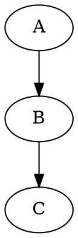
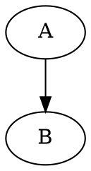

# GraphViz Document Type — Implementation Plan

> **For agentic workers:** REQUIRED SUB-SKILL: Use superpowers:subagent-driven-development (recommended) or superpowers:executing-plans to implement this plan task-by-task. Steps use checkbox (`- [ ]`) syntax for tracking.

**Goal:** Add GraphViz (DOT language) as a first-class document type in the mdeditor plugin registry.

**Architecture:** Two new files (renderer + plugin) and a one-line modification to the barrel export, exactly matching the pattern used by the JSON and mermaid doctypes. The WASM engine (`@hpcc-js/wasm-graphviz`) is loaded on-demand only when a `.dot` tab is first opened, keeping the initial bundle unchanged. Detection runs at priority 11 (above mermaid) using a brace-presence heuristic to distinguish `digraph { }` from mermaid's `graph TD/LR` syntax.

**Tech Stack:** React 18, Vite 7, TypeScript strict, `@hpcc-js/wasm-graphviz`, lucide-react (`Workflow` icon), Tailwind CSS 4

---

## File Map

| Action | Path | Purpose |
|--------|------|---------|
| Install | `@hpcc-js/wasm-graphviz` | DOT → SVG WASM engine |
| **Create** | `src/components/markdown/GraphvizPreview.tsx` | React renderer: empty/loading/error/SVG states |
| **Create** | `src/lib/document-types/plugins/graphviz.ts` | Plugin definition + lazy wrapper + detection fn |
| **Modify** | `src/lib/document-types/index.ts` | Add 1 import + 1 `register()` call |

---

## Task 1: Install `@hpcc-js/wasm-graphviz`

**Files:**
- Modify: `package.json` (via pnpm)

- [ ] **Step 1: Install the package**

```bash
cd /Volumes/FLOUNDER/dev/mdeditor
pnpm add @hpcc-js/wasm-graphviz
```

Expected output: `dependencies: + @hpcc-js/wasm-graphviz ...` (no errors)

- [ ] **Step 2: Verify entry in package.json**

```bash
grep '"@hpcc-js/wasm-graphviz"' package.json
```

Expected: `"@hpcc-js/wasm-graphviz": "^x.y.z"` — confirm it appears under `dependencies`.

- [ ] **Step 3: Commit**

```bash
git add package.json pnpm-lock.yaml
git commit -m "chore: add @hpcc-js/wasm-graphviz dependency"
```

---

## Task 2: Create `GraphvizPreview.tsx`

**Files:**
- Create: `src/components/markdown/GraphvizPreview.tsx`

`★ Insight ─────────────────────────────────────`
The WASM binary only downloads when `Graphviz.load()` is first called — not on `import`. This component is lazy-loaded via `React.lazy()` in the plugin, so the WASM download is doubly deferred: first the JS chunk, then the binary.
`─────────────────────────────────────────────────`

- [ ] **Step 1: Create the renderer component**

Create `/Volumes/FLOUNDER/dev/mdeditor/src/components/markdown/GraphvizPreview.tsx` with the following content:

```tsx
import { memo, useEffect, useRef, useState } from 'react'
import { Graphviz } from '@hpcc-js/wasm-graphviz'
import type { RendererProps } from '@/lib/document-types/types'

// ── WASM singleton ──────────────────────────────────────────────────
// Graphviz.load() fetches the WASM binary — call once, reuse forever.
let _graphvizPromise: Promise<Graphviz> | null = null

function getGraphviz(): Promise<Graphviz> {
  if (!_graphvizPromise) _graphvizPromise = Graphviz.load()
  return _graphvizPromise
}

// ── Component ───────────────────────────────────────────────────────

const GraphvizPreview = memo(({ content }: RendererProps) => {
  const containerRef = useRef<HTMLDivElement>(null)
  const [error, setError] = useState<string | null>(null)

  useEffect(() => {
    const container = containerRef.current
    if (!container) return

    if (!content.trim()) {
      container.innerHTML = ''
      setError(null)
      return
    }

    setError(null)

    getGraphviz()
      .then((gviz) => {
        const svg = gviz.dot(content, 'svg')
        container.innerHTML = svg
        // Make the SVG fill the container width responsively
        const svgEl = container.querySelector('svg')
        if (svgEl) {
          svgEl.setAttribute('width', '100%')
          svgEl.removeAttribute('height')
        }
      })
      .catch((err: unknown) => {
        const msg = err instanceof Error ? err.message : String(err)
        setError(msg)
        container.innerHTML = ''
      })
  }, [content])

  if (!content.trim()) {
    return (
      <div className="flex h-full w-full items-center justify-center p-8 text-muted-foreground/50">
        <p className="italic">Enter DOT language to see a live preview</p>
      </div>
    )
  }

  return (
    <div className="relative flex h-full w-full flex-col overflow-hidden rounded-md border bg-muted/20">
      {error !== null && (
        <div className="absolute right-4 top-4 z-30 pointer-events-none">
          <span className="rounded bg-background/80 px-2 py-1 text-xs font-semibold text-destructive shadow-sm backdrop-blur-sm">
            {error}
          </span>
        </div>
      )}
      <div
        ref={containerRef}
        className="flex-1 overflow-auto p-4 [&_svg]:max-w-full"
      />
    </div>
  )
})

GraphvizPreview.displayName = 'GraphvizPreview'

export default GraphvizPreview
```

- [ ] **Step 2: Typecheck the new file**

```bash
cd /Volumes/FLOUNDER/dev/mdeditor && pnpm typecheck 2>&1 | head -30
```

Expected: Only errors from files that don't yet import graphviz (none yet). Zero new errors introduced by this file.

> **If you see:** `Cannot find module '@hpcc-js/wasm-graphviz'` → Task 1 was not completed; run `pnpm add @hpcc-js/wasm-graphviz` first.

- [ ] **Step 3: Commit**

```bash
git add src/components/markdown/GraphvizPreview.tsx
git commit -m "feat: add GraphvizPreview renderer component"
```

---

## Task 3: Create `graphviz.ts` plugin

**Files:**
- Create: `src/lib/document-types/plugins/graphviz.ts`

- [ ] **Step 1: Create the plugin file**

Create `/Volumes/FLOUNDER/dev/mdeditor/src/lib/document-types/plugins/graphviz.ts` with the following content:

```typescript
/**
 * GraphViz Plugin — Document Type Definition
 *
 * Priority 11 (above mermaid=10) — checked first to claim `digraph`
 * and `graph { }` syntax before mermaid's first-word `'graph'` match fires.
 *
 * Detection uses a brace heuristic: mermaid's `graph TD/LR` never has
 * an opening brace on the header line; valid DOT always does.
 */

import { lazy, Suspense, createElement } from 'react'
import { Workflow } from 'lucide-react'
import type { DocumentTypePlugin, RendererProps } from '../types'

// ── Lazy renderer ───────────────────────────────────────────────────
// The @hpcc-js/wasm-graphviz WASM binary (~650 KB) is only fetched
// when this chunk is first loaded.

const LazyGraphvizPreview = lazy(
  () => import('@/components/markdown/GraphvizPreview'),
)

function GraphvizRendererWrapper({ content }: RendererProps) {
  return createElement(
    Suspense,
    {
      fallback: createElement(
        'div',
        { style: { padding: '1rem', color: '#888', fontStyle: 'italic' } },
        'Rendering diagram…',
      ),
    },
    createElement(LazyGraphvizPreview, { content }),
  )
}
GraphvizRendererWrapper.displayName = 'GraphvizRendererWrapper'

// ── Detection ───────────────────────────────────────────────────────

/**
 * Returns `true` when `text` is DOT language.
 *
 * Scans the first 100 characters for the DOT header pattern:
 *   [strict] (di)?graph [name] {
 *
 * The `{` requirement is the key discriminator: mermaid's `graph TD`
 * has no brace, so this never fires a false positive for mermaid content.
 *
 * The `is` flags enable dotAll (`.` matches `\n`) so a brace on the
 * next line (e.g. K&R style) is also detected.
 */
export function isGraphvizText(text: string): boolean {
  const peek = text.trimStart().slice(0, 100)
  return /^(strict\s+)?(di)?graph(\s+[\w"]+)?\s*\{/is.test(peek)
}

// ── Default content ─────────────────────────────────────────────────

const defaultGraphvizContent = `digraph Pipeline {
    rankdir=LR;
    node [shape=box];

    DiscoverFiles -> ParseAST [label="inputs: repo_root:str, extensions:list[str]\\noutputs: file_paths:list[str]"];
    ParseAST -> ExtractSpans [label="inputs: file_path:str, code:str, parser\\noutputs: spans:list[(int,int)]"];
    ExtractSpans -> MakeChunks [label="inputs: repo_root:str, file_path:str, language:str,\\nspans & code\\noutputs: CodeChunks:list[CodeChunk]"];
    MakeChunks -> BuildGraphDocs [label="inputs: CodeChunks\\noutputs: GraphNodes:list[GraphNode], GraphEdges:list[GraphEdge]"];
    BuildGraphDocs -> PersistGraph [label="inputs: nodes, edges, Neo4j credentials\\noutputs: graph persisted"];
    PersistGraph -> GenerateEmbeddings [label="inputs: CodeChunks, embedder\\noutputs: embeddings:numpy.ndarray"];
    GenerateEmbeddings -> UpsertVectors [label="inputs: embeddings, Qdrant client, metadata\\noutputs: vectors stored"];
    UpsertVectors -> VectorSearch [label="inputs: query:str, embedder, top_k:int\\noutputs: semantic hits:list[(id, score, payload)]"];
    VectorSearch -> LoadGraph [label="inputs: Neo4j driver\\noutputs: graph:nx.DiGraph"];
    LoadGraph -> ExpandNeighbourhood [label="inputs: graph:nx.DiGraph, seed_ids:list[str], max_hops:int\\noutputs: neighbour_ids:set[str]"];
    ExpandNeighbourhood -> RerankWithPageRank [label="inputs: semantic hits, neighbour_ids, PageRank scores\\noutputs: candidates:list[RetrievalCandidate]"];
    RerankWithPageRank -> HydrateChunks [label="inputs: semantic hits\\noutputs: hydrated_chunks:dict[str,CodeChunk]"];
    HydrateChunks -> SelectContext [label="inputs: candidates, hydrated_chunks, max_chunks:int\\noutputs: context:list[CodeChunk]"];
    SelectContext -> BuildPrompt [label="inputs: query:str, context:list[CodeChunk]\\noutputs: prompt:str"];
    BuildPrompt -> LLMCall [label="inputs: prompt\\noutputs: answer:str"];
}
`

// ── Plugin definition ───────────────────────────────────────────────

export const graphvizPlugin: DocumentTypePlugin = {
  kind: 'graphviz',
  label: 'GraphViz Diagram',
  icon: Workflow,
  detect: isGraphvizText,
  priority: 11,
  renderer: GraphvizRendererWrapper,
  fileExtensions: ['.dot', '.gv'],
  exportMimeType: 'text/plain',
  exportExtension: '.dot',
  defaultContent: defaultGraphvizContent,
  defaultTitle: (n: number) => `Graph-${n}`,
  tabColor: 'oklch(0.65 0.18 45)',
}
```

- [ ] **Step 2: Typecheck**

```bash
cd /Volumes/FLOUNDER/dev/mdeditor && pnpm typecheck 2>&1 | head -30
```

Expected: 0 errors.

> **If you see:** `Module '"lucide-react"' has no exported member 'Workflow'` → Replace `Workflow` with `Network` (both are valid lucide-react icons; `Network` is the fallback).

- [ ] **Step 3: Commit**

```bash
git add src/lib/document-types/plugins/graphviz.ts
git commit -m "feat: add graphviz document type plugin"
```

---

## Task 4: Register plugin in barrel

**Files:**
- Modify: `src/lib/document-types/index.ts`

The current file ends with:
```typescript
import { jsonPlugin } from './plugins/json'

register(markdownPlugin)
register(mermaidPlugin)
register(htmlPlugin)
register(reactComponentPlugin)
register(jsonPlugin)
```

- [ ] **Step 1: Add the import and registration**

Open `src/lib/document-types/index.ts`. After the `jsonPlugin` import line, add:
```typescript
import { graphvizPlugin } from './plugins/graphviz'
```

After `register(jsonPlugin)`, add:
```typescript
register(graphvizPlugin)
```

The bottom of the file should now read:

```typescript
import { register } from './registry'
import { markdownPlugin } from './plugins/markdown'
import { mermaidPlugin } from './plugins/mermaid'
import { htmlPlugin } from './plugins/html'
import { reactComponentPlugin } from './plugins/react-component'
import { jsonPlugin } from './plugins/json'
import { graphvizPlugin } from './plugins/graphviz'

register(markdownPlugin)
register(mermaidPlugin)
register(htmlPlugin)
register(reactComponentPlugin)
register(jsonPlugin)
register(graphvizPlugin)
```

- [ ] **Step 2: Typecheck**

```bash
cd /Volumes/FLOUNDER/dev/mdeditor && pnpm typecheck 2>&1
```

Expected: `Found 0 errors.`

- [ ] **Step 3: Lint**

```bash
cd /Volumes/FLOUNDER/dev/mdeditor && pnpm lint 2>&1
```

Expected: No output (0 warnings). If there are warnings, fix them before continuing.

- [ ] **Step 4: Commit**

```bash
git add src/lib/document-types/index.ts
git commit -m "feat: register graphviz document type plugin"
```

---

## Task 5: Production build + WASM verification

**Files:** None changed — this task validates the build.

- [ ] **Step 1: Run production build**

```bash
cd /Volumes/FLOUNDER/dev/mdeditor && pnpm build 2>&1
```

Expected: `✓ built in X.XXs` with no errors.

> **If the build fails with a WASM or worker error from `@hpcc-js/wasm-graphviz`:**
> Open `vite.config.ts` and add `exclude` to the existing `optimizeDeps` block:
>
> ```typescript
> optimizeDeps: {
>   include: ['react', 'react-dom', 'react-markdown'],
>   exclude: ['@hpcc-js/wasm-graphviz'],
> },
> ```
>
> Then re-run `pnpm build`. If the build still fails, check the error message — the WASM binary may need to be copied manually; add a `vite-plugin-wasm` package or equivalent.

- [ ] **Step 2: Verify graphviz chunk in dist**

```bash
ls /Volumes/FLOUNDER/dev/mdeditor/dist/assets/ | grep -i graphviz
```

Expected: At least one `.js` chunk referencing graphviz (Rollup creates a separate async chunk for the lazy-loaded module). A `.wasm` file may also appear.

- [ ] **Step 3: Commit (if vite.config.ts was changed)**

```bash
# Only if optimizeDeps was modified in Step 1:
git add vite.config.ts
git commit -m "fix: exclude @hpcc-js/wasm-graphviz from Vite optimizer"
```

---

## Task 6: Manual verification

**Prerequisites:** Dev server running at `http://localhost:5200` (`pnpm dev`)

- [ ] **Checkpoint 1 — New tab menu**

Open the app. Click the "New Tab" button (or equivalent menu). Confirm:
- "GraphViz Diagram" appears in the list
- It shows the `Workflow` icon (grid/flow icon)
- Clicking it opens a tab with an orange tab header

- [ ] **Checkpoint 2 — Default content renders**

The new GraphViz tab should immediately render the Pipeline digraph SVG in the preview pane. Confirm a left-to-right graph with nodes like `DiscoverFiles`, `ParseAST`, etc. is visible.

- [ ] **Checkpoint 3 — Auto-detection on paste**

Open a blank Markdown tab. Paste the following DOT:



Confirm the tab automatically re-detects as `GraphViz Diagram` and the preview updates to show a simple 3-node graph.

- [ ] **Checkpoint 4 — Mermaid not broken**

Paste the following into a blank tab:

```
graph TD
  Start --> End
```

Confirm it detects as **Mermaid Diagram** (not GraphViz). The brace heuristic must not fire on `graph TD`.

- [ ] **Checkpoint 5 — Error state**

In a GraphViz tab, replace the content with invalid DOT:

```
digraph Broken {
  this is not valid dot !!!
```

Confirm a red error badge appears in the top-right of the preview pane showing the parse error. The app must not crash.

- [ ] **Checkpoint 6 — Empty state**

Clear the editor content completely. Confirm the preview shows:
> *Enter DOT language to see a live preview*

- [ ] **Checkpoint 7 — File drop**

Create a file `test.dot` on disk with content:

Drag-and-drop it onto the editor. Confirm it opens as a `GraphViz Diagram` tab (not Markdown).

- [ ] **Checkpoint 8 — Export**

With a GraphViz tab active, use the export/save function. Confirm the downloaded file has a `.dot` extension.

- [ ] **Checkpoint 9 — Existing types unaffected**

Open a new Markdown tab, a Mermaid tab, and a JSON tab. Confirm they all render correctly and the GraphViz plugin does not interfere.

- [ ] **Checkpoint 10 — Network tab: lazy WASM load**

Open browser DevTools → Network tab. Hard-refresh the page. Confirm no `.wasm` request fires on initial load. Then open a GraphViz tab — confirm the WASM binary downloads at that point (not before).

- [ ] **Step 11: Final commit**

```bash
git add -p  # review any remaining uncommitted changes
git commit -m "feat: graphviz doctype — complete implementation"
```

---

## Troubleshooting Reference

| Symptom | Cause | Fix |
|---------|-------|-----|
| `Cannot find module '@hpcc-js/wasm-graphviz'` | Package not installed | `pnpm add @hpcc-js/wasm-graphviz` |
| `Module has no exported member 'Workflow'` | Old lucide-react version | Use `Network` instead of `Workflow` |
| WASM fetch 404 in production | Vite optimizer inlined the worker | Add `exclude: ['@hpcc-js/wasm-graphviz']` to `optimizeDeps` |
| `graph TD` detects as graphviz | Priority/detection bug | Confirm `priority: 11` and that the regex requires `\{` |
| SVG overflows container | SVG has fixed width | Confirm `svgEl.setAttribute('width', '100%')` runs in the effect |
