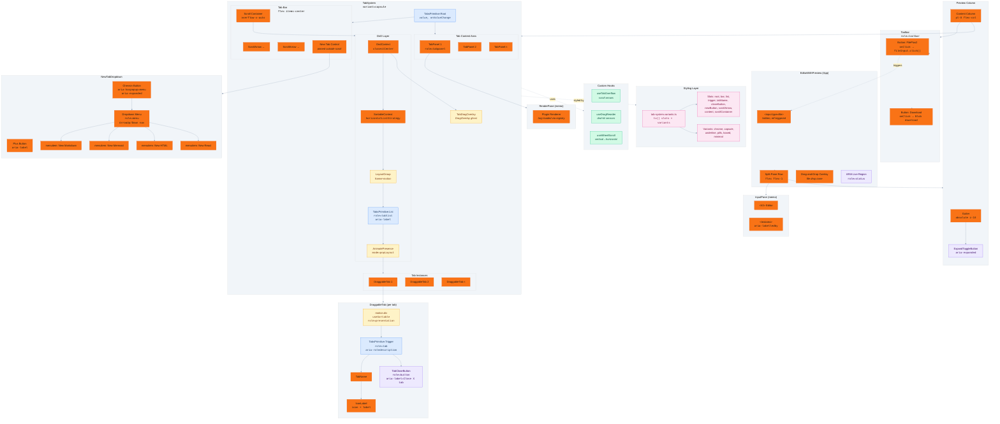

# Tab System Architecture

Component hierarchy and data flow for the tab system in `EditorWithProview`.

```mermaid
%%{ init: { 'theme': 'base', 'themeVariables': { 'primaryColor': '#f97316', 'primaryTextColor': '#1a1a1a', 'primaryBorderColor': '#ea580c', 'lineColor': '#94a3b8', 'secondaryColor': '#fef3c7', 'tertiaryColor': '#f1f5f9' } } }%%

flowchart TD
    subgraph EditorWithPreview["EditorWithPreview (App)"]
        direction TB
        HiddenInput["&lt;input type=file&gt;<br/><i>hidden, ref-triggered</i>"]
        MainRow["Split-Pane Row<br/><code>flex flex-1</code>"]
        DragOverlay_App["Drag-and-Drop Overlay<br/><i>file drop zone</i>"]
        PreviewStatus["ARIA Live Region<br/><code>role=status</code>"]
    end

    subgraph InputPane_Box["InputPane (memo)"]
        EditorHeading["&lt;h3&gt; Editor"]
        Textarea["&lt;textarea&gt;<br/><code>aria-labelledby</code>"]
    end

    subgraph PreviewSide["Preview Column"]
        direction TB
        Gutter["Gutter<br/><code>absolute z-10</code>"]
        ExpandToggle["ExpandToggleButton<br/><code>aria-expanded</code>"]
        ContentCol["Content Column<br/><code>pl-8 flex-col</code>"]
    end

    subgraph Toolbar["Toolbar<br/><code>role=toolbar</code><br/><code>justify-end</code>"]
        AddFileBtn["Button: FilePlus2<br/><code>onClick → fileInput.click()</code>"]
        DownloadBtn["Button: Download<br/><code>onClick → Blob download</code>"]
    end

    subgraph TabSystem_Box["TabSystem<br/><code>variant=capsule</code>"]
        direction TB
        RadixRoot["TabsPrimitive.Root<br/><code>value, onValueChange</code>"]

        subgraph TabBar["Tab Bar<br/><code>flex items-center</code>"]
            direction LR
            ScrollL["ScrollArrow ←"]
            ScrollContainer["Scroll Container<br/><code>overflow-x-auto</code>"]
            ScrollR["ScrollArrow →"]
            NewTabArea["New Tab Control<br/><i>pinned outside scroll</i>"]
        end

        subgraph DndLayer["DnD Layer"]
            DndCtx["DndContext<br/><code>closestCenter</code>"]
            SortCtx["SortableContext<br/><code>horizontalListStrategy</code>"]
            LayoutGrp["LayoutGroup<br/><i>framer-motion</i>"]
            TabList["TabsPrimitive.List<br/><code>role=tablist</code><br/><code>aria-label</code>"]
            AnimPres["AnimatePresence<br/><code>mode=popLayout</code>"]
        end

        subgraph TabInstances["Tab Instances"]
            direction LR
            ST1["DraggableTab 1"]
            ST2["DraggableTab 2"]
            STn["DraggableTab n"]
        end

        DragGhost["TabDragOverlay<br/><i>DragOverlay ghost</i>"]

        subgraph ContentArea["Tab Content Area"]
            TC1["TabPanel 1<br/><code>role=tabpanel</code>"]
            TC2["TabPanel 2"]
            TCn["TabPanel n"]
        end
    end

    subgraph DraggableTab_Detail["DraggableTab (per tab)"]
        direction TB
        MotionDiv["motion.div<br/><code>useSortable</code><br/><code>role=presentation</code>"]
        RadixTrigger["TabsPrimitive.Trigger<br/><code>role=tab</code><br/><code>aria-roledescription</code>"]
        TabNameComp["TabName"]
        IconLabelComp["IconLabel<br/><code>icon + label</code>"]
        CloseBtn["TabCloseButton<br/><code>role=button</code><br/><code>aria-label=Close X tab</code>"]
    end

    subgraph NewTabControl_Detail["NewTabDropdown"]
        direction TB
        PlusBtn["Plus Button<br/><code>aria-label</code>"]
        ChevBtn["Chevron Button<br/><code>aria-haspopup=menu</code><br/><code>aria-expanded</code>"]
        DropMenu["Dropdown Menu<br/><code>role=menu</code><br/><code>ArrowUp/Down nav</code>"]
        MI1["menuitem: New Markdown"]
        MI2["menuitem: New Mermaid"]
        MI3["menuitem: New HTML"]
        MI4["menuitem: New React"]
    end

    subgraph RenderPane_Box["RenderPane (memo)"]
        PluginRenderer["Plugin Renderer<br/><i>lazy-loaded via registry</i>"]
    end

    subgraph Hooks["Custom Hooks"]
        direction LR
        H1["useTabOverflow<br/><i>scroll arrows</i>"]
        H2["useDragReorder<br/><i>dnd-kit sensors</i>"]
        H3["useWheelScroll<br/><i>vertical→horizontal</i>"]
    end

    subgraph Styling["Styling Layer"]
        direction LR
        TV["tab-system.variants.ts<br/><code>tv() slots × variants</code>"]
        Slots["Slots: root, bar, list,<br/>trigger, tabName, closeButton,<br/>newButton, scrollArrow,<br/>content, scrollContainer"]
        Variants["Variants: chrome, capsule,<br/>underline, pills, boxed, minimal"]
    end

    %% Connections
    EditorWithPreview --> MainRow
    MainRow --> InputPane_Box
    MainRow --> PreviewSide
    Gutter --> ExpandToggle
    ContentCol --> Toolbar
    ContentCol --> TabSystem_Box
    Toolbar --> AddFileBtn
    Toolbar --> DownloadBtn
    AddFileBtn -.->|triggers| HiddenInput

    RadixRoot --> TabBar
    RadixRoot --> ContentArea
    ScrollContainer --> DndLayer
    DndCtx --> SortCtx
    SortCtx --> LayoutGrp
    LayoutGrp --> TabList
    TabList --> AnimPres
    AnimPres --> TabInstances
    DndCtx --> DragGhost
    NewTabArea --> NewTabControl_Detail

    ST1 --> DraggableTab_Detail
    MotionDiv --> RadixTrigger
    RadixTrigger --> TabNameComp
    TabNameComp --> IconLabelComp
    RadixTrigger --> CloseBtn

    ChevBtn --> DropMenu
    DropMenu --> MI1
    DropMenu --> MI2
    DropMenu --> MI3
    DropMenu --> MI4

    TC1 --> RenderPane_Box

    TabSystem_Box -.->|uses| Hooks
    TabSystem_Box -.->|styled by| Styling
    TV --> Slots
    TV --> Variants

    classDef radix fill:#dbeafe,stroke:#3b82f6,color:#1e3a5f
    classDef motion fill:#fef3c7,stroke:#f59e0b,color:#78350f
    classDef hook fill:#d1fae5,stroke:#10b981,color:#064e3b
    classDef aria fill:#ede9fe,stroke:#8b5cf6,color:#3b0764
    classDef styling fill:#fce7f3,stroke:#ec4899,color:#831843

    class RadixRoot,RadixTrigger,TabList radix
    class MotionDiv,AnimPres,LayoutGrp,DragGhost motion
    class H1,H2,H3 hook
    class PreviewStatus,CloseBtn,ExpandToggle aria
    class TV,Slots,Variants styling
```
