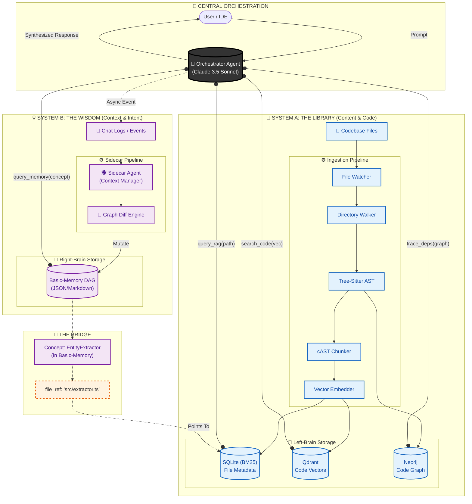

# Agent Learning Protocol — System Architecture

```mermaid
flowchart TB
    %% --- STYLING ---
    classDef leftBrain fill:#e3f2fd,stroke:#1565c0,stroke-width:2px,color:#0d47a1
    classDef rightBrain fill:#f3e5f5,stroke:#7b1fa2,stroke-width:2px,color:#4a148c
    classDef orchestrator fill:#333,stroke:#000,stroke-width:3px,color:#fff
    classDef bridge fill:#fff3e0,stroke:#e65100,stroke-dasharray: 5 5,stroke-width:2px

    %% --- ORCHESTRATOR (THE USER INTERFACE) ---
    subgraph ORCHESTRATION ["🎯 CENTRAL ORCHESTRATION"]
        User([User / IDE]) -->|Prompt| Agent[("🤖 Orchestrator Agent<br/>(Claude 3.5 Sonnet)")]
        Agent -->|Synthesized Response| User
    end

    %% --- SYSTEM A: LEFT BRAIN (CONTENT) ---
    subgraph LEFT_BRAIN ["🧠 SYSTEM A: THE LIBRARY (Content & Code)"]
        direction TB
        Codebase["📁 Codebase Files"]
        
        subgraph INGESTION ["⚙️ Ingestion Pipeline"]
            Watcher[File Watcher] --> Walker[Directory Walker]
            Walker --> Parser[Tree-Sitter AST]
            Parser --> Chunker[cAST Chunker]
            Chunker --> Embedder[Vector Embedder]
        end

        subgraph LEFT_STORAGE ["💾 Left-Brain Storage"]
            SQLite[("SQLite (BM25)<br/>File Metadata")]
            Qdrant[("Qdrant<br/>Code Vectors")]
            Neo4j[("Neo4j<br/>Code Graph")]
        end

        Codebase --> Watcher
        Embedder --> SQLite
        Embedder --> Qdrant
        Parser --> Neo4j

        %% Retrieval Paths
        Agent o--o|"query_rag(path)"| SQLite
        Agent o--o|"search_code(vec)"| Qdrant
        Agent o--o|"trace_deps(graph)"| Neo4j
    end

    %% --- SYSTEM B: RIGHT BRAIN (CONTEXT) ---
    subgraph RIGHT_BRAIN ["💡 SYSTEM B: THE WISDOM (Context & Intent)"]
        direction TB
        Conversation["💬 Chat Logs / Events"]
        
        subgraph CURATION ["⚙️ Sidecar Pipeline"]
            SidecarAgent["🕵️ Sidecar Agent<br/>(Context Manager)"]
            DiffEngine["📝 Graph Diff Engine"]
        end

        subgraph RIGHT_STORAGE ["💾 Right-Brain Storage"]
            JSONGraph[("Basic-Memory DAG<br/>(JSON/Markdown)")]
        end

        Agent -.->|Async Event| Conversation
        Conversation --> SidecarAgent
        SidecarAgent --> DiffEngine
        DiffEngine -->|Mutate| JSONGraph

        %% Retrieval Paths
        Agent o--o|"query_memory(concept)"| JSONGraph
    end

    %% --- THE BRIDGE (THE ANCHOR) ---
    subgraph BRIDGE ["🔗 THE BRIDGE"]
        direction LR
        ConceptNode["Concept: EntityExtractor<br/>(in Basic-Memory)"]
        FileRef["file_ref: 'src/extractor.ts'"]
        
        ConceptNode -.-> FileRef
        FileRef -.->|Points To| SQLite
    end

    %% Links spanning graphs
    JSONGraph -.-> ConceptNode

    %% Classes (Bridge is subgraph id, not a node; only FileRef gets bridge style)
    class Codebase,Watcher,Walker,Parser,Chunker,Embedder,SQLite,Qdrant,Neo4j leftBrain
    class Conversation,SidecarAgent,DiffEngine,JSONGraph,ConceptNode rightBrain
    class Agent orchestrator
    class FileRef bridge
```
