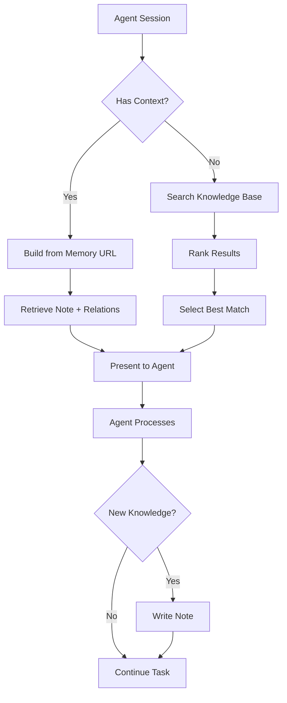
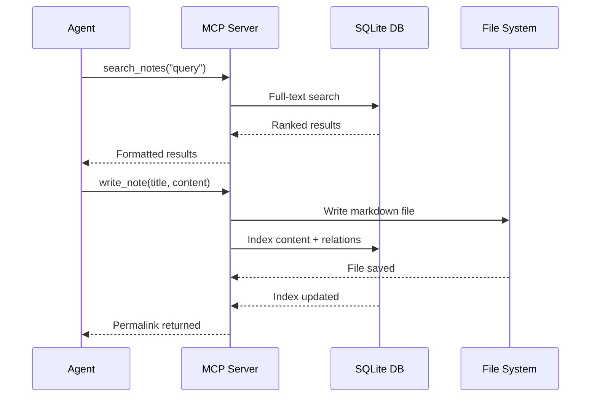
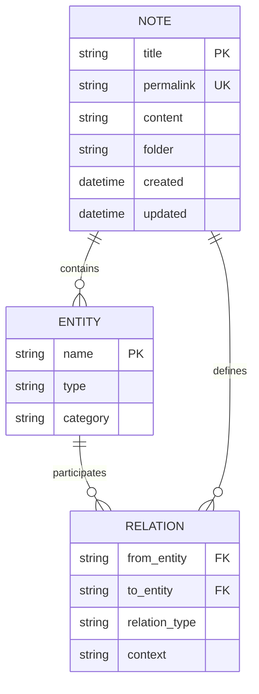
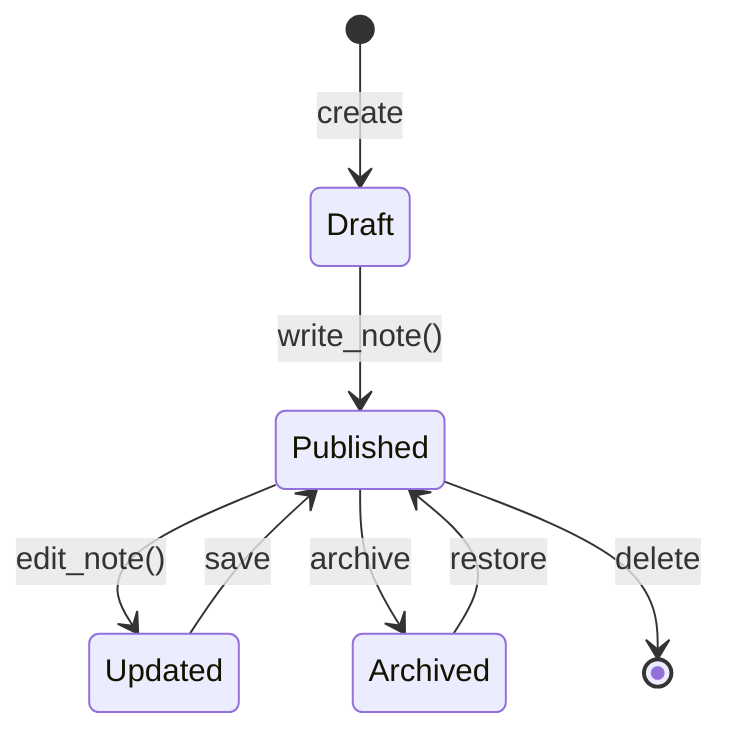
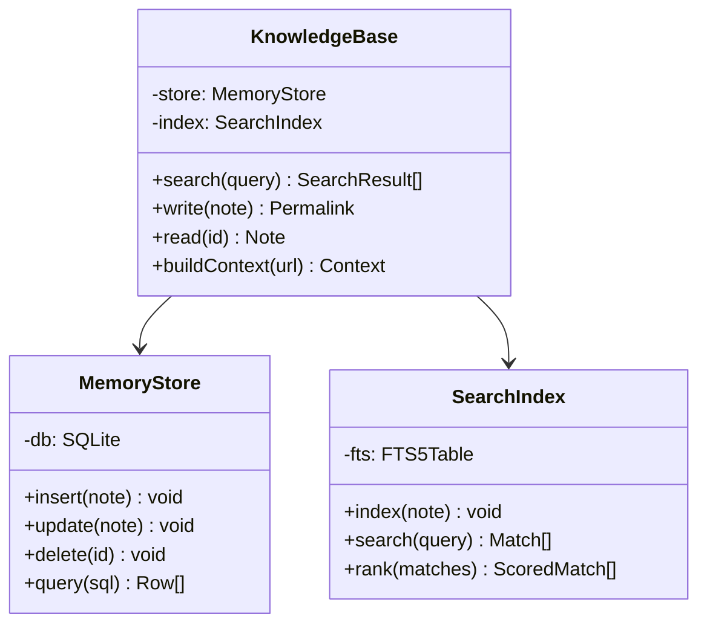

# Memory System Knowledge Base

## Overview

The memory system provides **persistent knowledge storage** for AI agents across sessions. It uses a `graph-based architecture` where notes are connected through typed relations.

> **Key Principle**: Every piece of knowledge should be discoverable through multiple paths — by title, by relation, or by content search.

---

## Architecture

### System Flow



### Component Interaction



---

## Data Model

### Entity-Relation Graph



### Note Types

| Type | Description | Example |
|------|-------------|---------|
| `note` | General knowledge | Session summaries |
| `concept` | Abstract ideas | Design patterns |
| `reference` | External sources | API documentation |
| `decision` | Architectural choices | Tech stack selection |
| `observation` | Runtime findings | Performance metrics |

---

## Mathematical Foundations

### Relevance Scoring

The search system uses TF-IDF with BM25 ranking:

$$S(q, d) = \sum_{t \in q} \text{IDF}(t) \cdot \frac{f(t, d) \cdot (k_1 + 1)}{f(t, d) + k_1 \cdot (1 - b + b \cdot \frac{|d|}{avgdl})}$$

Where:
- $f(t, d)$ is the term frequency of term $t$ in document $d$
- $|d|$ is the document length
- $avgdl$ is the average document length
- $k_1 = 1.2$ and $b = 0.75$ are tuning parameters

### Graph Traversal

For relation depth $n$, the connected set is:

$$C_n(e) = \{e' : \exists \text{ path } p = (e, r_1, e_1, r_2, \ldots, r_n, e') \text{ with } |p| \leq n\}$$

---

## Implementation Details

### TypeScript Interface

```typescript
interface Note {
  title: string
  permalink: string
  content: string
  folder: string
  metadata: Record<string, unknown>
  created_at: Date
  updated_at: Date
}

interface SearchResult {
  entity: string
  score: number
  content: string | null
  file_path: string
  relation_type: string | null
}

async function searchNotes(
  query: string,
  options: SearchOptions = {}
): Promise<SearchResult[]> {
  const { page = 1, pageSize = 10, searchType = 'text' } = options
  // Full-text search with BM25 ranking
  return db.search(query, { page, pageSize, searchType })
}
```

### Python Backend

```python
class MemoryStore:
    """SQLite-backed knowledge store with full-text search."""

    def __init__(self, db_path: str):
        self.db = sqlite3.connect(db_path)
        self._init_fts()

    def _init_fts(self):
        self.db.execute("""
            CREATE VIRTUAL TABLE IF NOT EXISTS notes_fts
            USING fts5(title, content, folder)
        """)

    def search(self, query: str, limit: int = 10) -> list[dict]:
        return self.db.execute(
            "SELECT *, rank FROM notes_fts WHERE notes_fts MATCH ? ORDER BY rank LIMIT ?",
            (query, limit)
        ).fetchall()
```

### Shell Usage

```bash
# Search the knowledge base
curl -X POST http://localhost:8080/search \
  -H "Content-Type: application/json" \
  -d '{"query": "memory architecture", "page_size": 5}'

# Write a new note
curl -X POST http://localhost:8080/notes \
  -H "Content-Type: application/json" \
  -d '{"title": "Session Summary", "content": "# Summary\n\nKey findings...", "folder": "sessions"}'
```

---

## State Machine

### Note Lifecycle



### Search Pipeline


---

## Class Structure



---

## Performance Metrics

### Benchmark Results

| Operation | P50 (ms) | P95 (ms) | P99 (ms) |
|-----------|----------|----------|----------|
| `search_notes` | 12 | 45 | 120 |
| `read_note` | 3 | 8 | 15 |
| `write_note` | 18 | 52 | 180 |
| `build_context` | 25 | 95 | 350 |

### Scaling Characteristics

The system handles growth gracefully:

- **10k notes**: All operations under 50ms P95
- **100k notes**: Search degrades to ~200ms P95
- **1M notes**: Requires index partitioning

---

## Task Lists

- [x] Core CRUD operations
- [x] Full-text search with BM25
- [x] Relation graph traversal
- [ ] Semantic similarity search
- [ ] Auto-categorization
- [ ] Cross-project linking

---

## Footnotes

This document covers the core memory system architecture[^1]. For deployment details, see the operations guide[^2].

[^1]: Based on the Basic Memory v2 architecture specification.
[^2]: Operations guide covers SQLite tuning, backup strategies, and monitoring.
