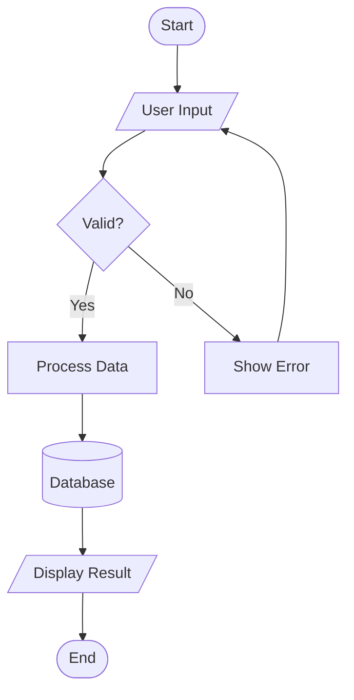
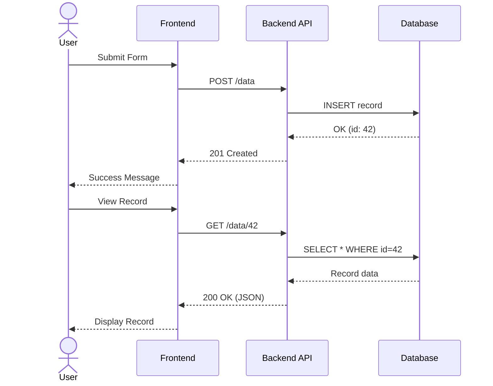
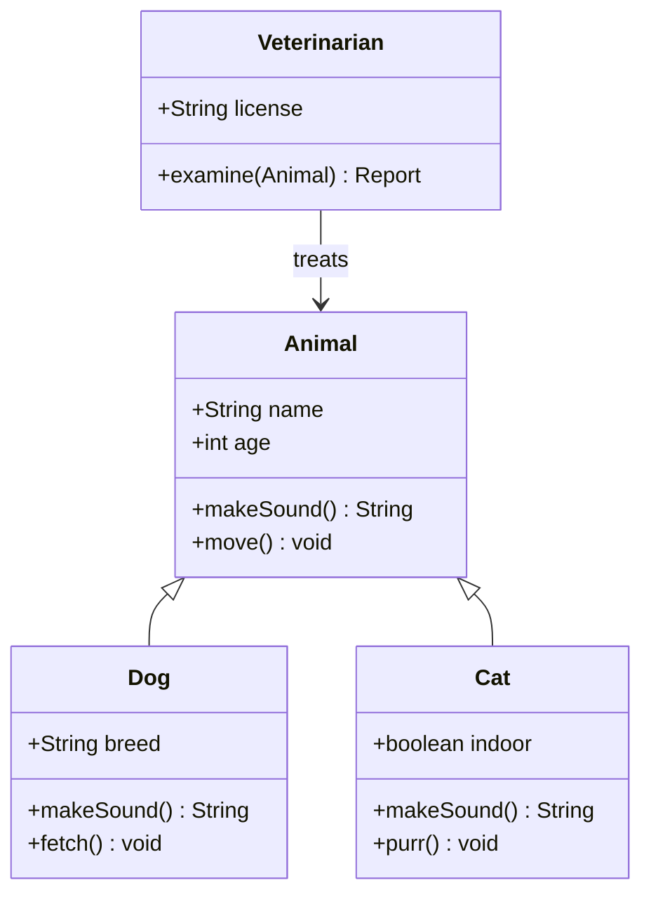
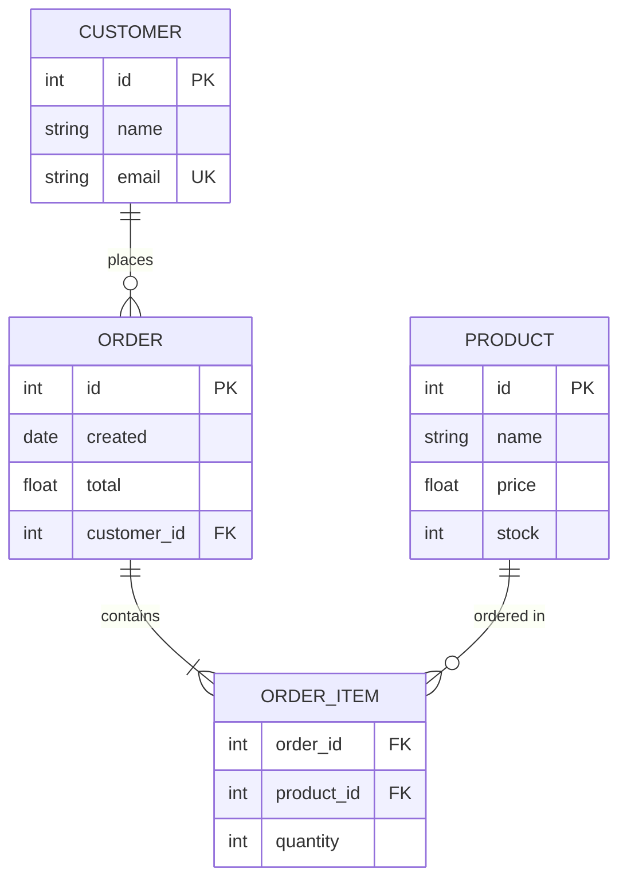
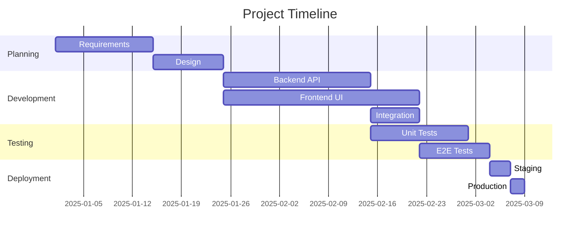
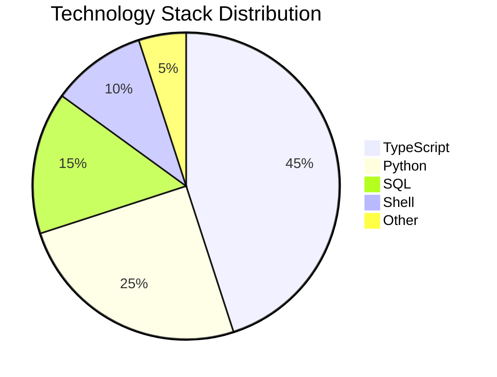

# Mermaid Diagram Types Test

This document tests rendering of multiple mermaid diagram types on a single page. Each diagram should render as an SVG without ID collisions.

---

## 1. Flowchart



## 2. Sequence Diagram



## 3. Class Diagram



## 4. Entity Relationship Diagram



## 5. Gantt Chart



## 6. Pie Chart



---

## Inline Code Test

Here's some `inline code` that should NOT be rendered as a code block. The variable `diagramCounter` was the old approach, now replaced with `renderIdRef`.

## Untyped Code Block

```
This is an untyped code block.
It has no language specified.
It should render as plain preformatted text.
```

## Typed Code Block (Not Mermaid)

```javascript
// This should get syntax highlighting, NOT mermaid rendering
const diagram = "flowchart TD; A-->B";
console.log(diagram);
```

---

**Test complete.** If all 6 mermaid diagrams render as SVGs, inline code stays inline, untyped blocks are plain, and JS blocks get syntax highlighting — the document detector is working correctly.
