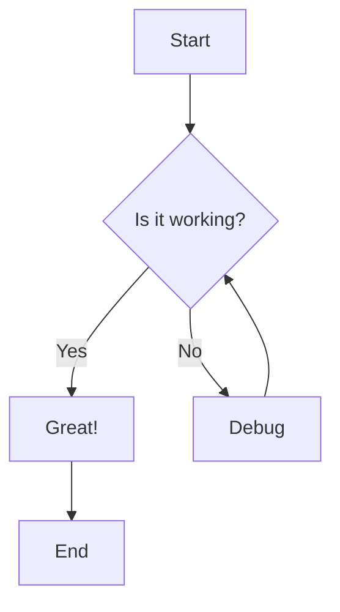
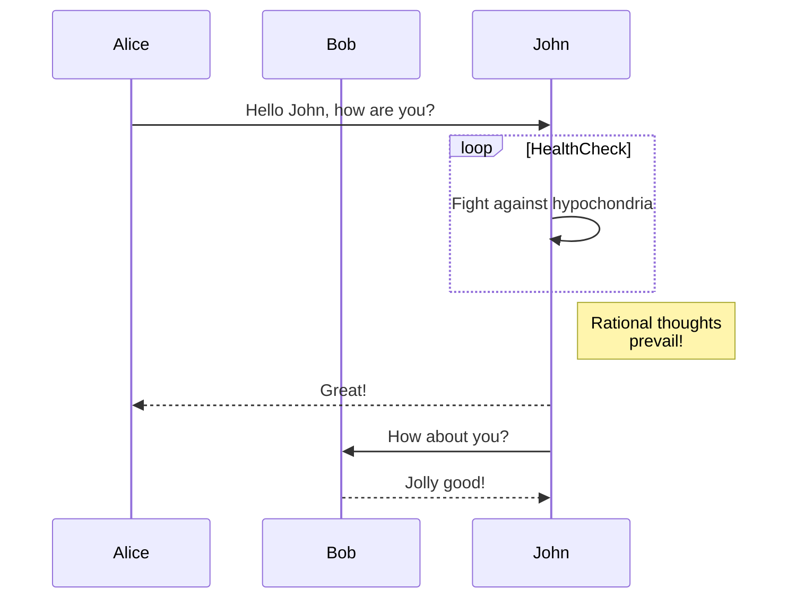
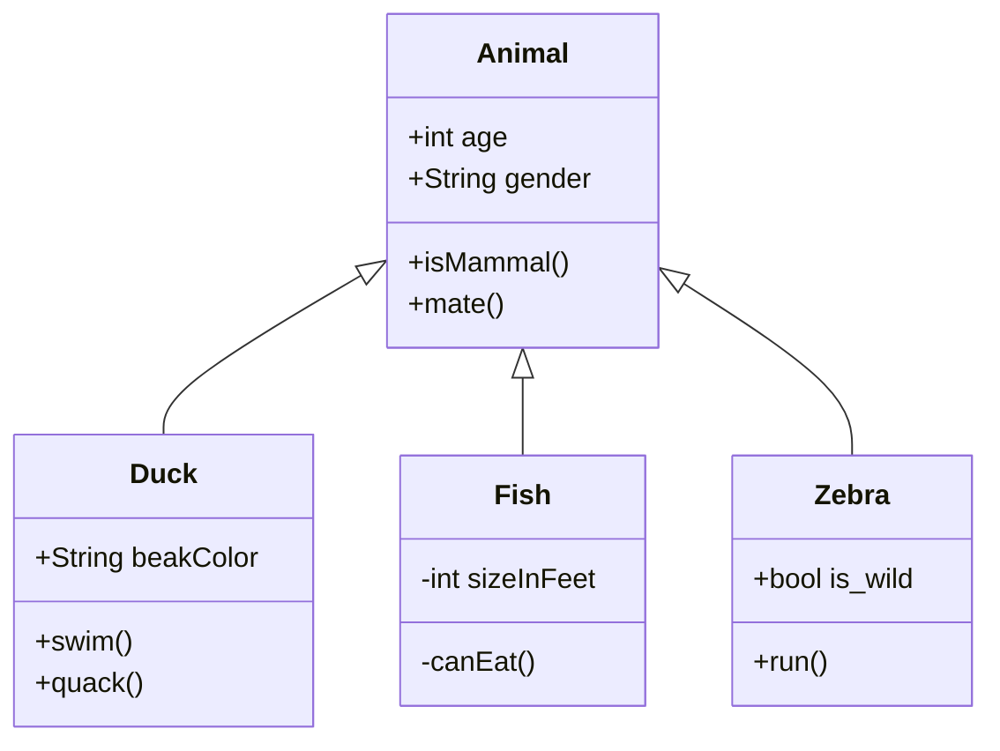
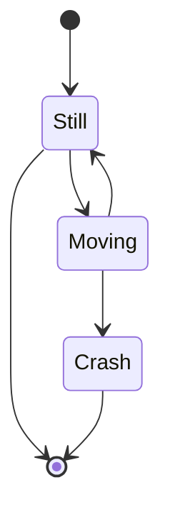
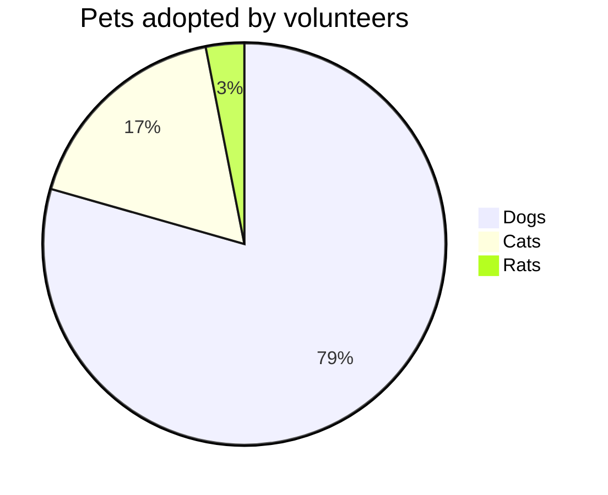
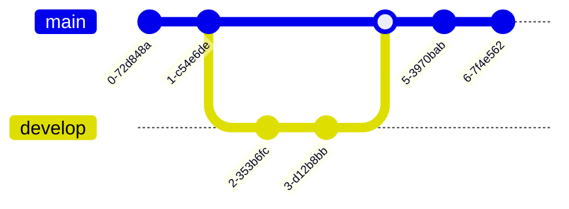

# Mermaid Diagram Test

## Flowchart Example



## Sequence Diagram



## Class Diagram



## State Diagram



## Pie Chart



## Git Graph



## Regular Code Block (Should NOT be Mermaid)

```typescript
const greeting = "Hello, World!";
console.log(greeting);
```
